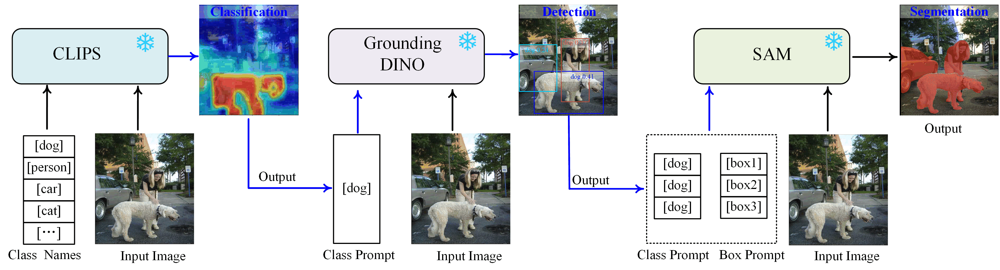

# Prompt is All You Need: Prompting Foundation Models for Large-scale Self-supervised Semantic Segmentation

Official implementation of PLUSSβ framework with trainable semantic and box tuners for improved language-driven semantic segmentation on ImageNet-S dataset.

**🚀 Now with Multi-GPU Training Support!**

## Introduction

Schematic overview of the PLUSSα pipeline. The method employs a cascade structure: image-level CLIPS identifies category concepts and generates a class prompt for region-level Grounding DINO. The resulting bounding box, enriched with category semantics, is then passed to SAM to produce the final semantic segmentation map. A noted limitation is that errors from CLIPS or Grounding DINO can propagate, leading to false or missing segmentation.

Overview of the PLUSSβ. 
    The architecture builds upon the frozen foundation models (CLIPS, Grounding DINO, SAM) from PLUSSα, introducing two trainable prompt tuners: a Semantic Tuner and a Box Tuner. The model processes data through two parallel branches: a point-prompt branch (using points sampled from CLIPS attention maps) and a box-prompt branch (using boxes from Grounding DINO). The proposed tuners are trained to resolve inconsistencies between these branches. For visual clarity, positive and negative point prompts for SAM are shown in orange and blue, respectively. During inference, only the more efficient box-prompt branch is active.
## Overview

LPUSSβ builds upon the PLUSSα pipeline by introducing two key trainable components:

1. **Semantic Tuner**: Visual prompt tuning module that improves semantic discrimination of CLIP features
2. **Box Tuner**: Region-level feature fusion module that refines bounding box localization

### Architectural Design Principle

**CRITICAL**: The semantic tuner and box tuner operate with **COMPLETELY SEPARATE computational graphs**:

- **Semantic Tuner**: Specializes in improving semantic feature discrimination
  - Trained with alignment loss on hard examples from memory bank
  - No gradients from box loss
  
- **Box Tuner**: Specializes in improving spatial localization
  - Trained with L1 + GIoU loss on pseudo boxes
  - No gradients from semantic alignment loss

This isolation ensures each module focuses on its specific objective without interference.

## Features

✅ Separate computational graphs for Semantic and Box Tuners  
✅ Multi-GPU distributed training (DDP)  
✅ Gradient accumulation for large effective batch sizes  
✅ Mixed precision training (FP16/AMP)  
✅ Hard example memory bank  
✅ Point-to-box conversion  
✅ Complete ImageNet-S dataset support (50/300/919 classes)  
✅ Comprehensive evaluation metrics  

## Installation

```bash
# Create conda environment
conda create -n pluss_beta python=3.9
conda activate pluss_beta

# Install dependencies
pip install torch torchvision --index-url https://download.pytorch.org/whl/cu118
pip install opencv-python pillow matplotlib
pip install scikit-learn numpy tqdm
pip install wandb  # Optional, for logging

# Install CLIP
pip install git+https://github.com/openai/CLIP.git

# Install SAM
pip install git+https://github.com/facebookresearch/segment-anything.git

# Install Grounding DINO (follow their official instructions)
```

## Dataset Structure

Prepare dataset follow the [official instructions](https://github.com/LUSSeg/ImageNet-S). ImageNet-S dataset should be organized as follows:
```
imagenet-s/
├── ImageNetS50/
│   ├── train/
│   ├── train-semi/
│   ├── train-semi-segmentation/
│   ├── validation/
│   ├── validation-segmentation/
│   └── test/
├── ImageNetS300/
│   └── ... (same structure)
└── ImageNetS919/
    └── ... (same structure)
```

Annotations are stored as PNG with RGB channels:
- Class ID = R + G × 256
- Ignored region = 1000
- Other category = 0

## Training

### Single GPU Training

```bash
python pluss_beta/train.py \
    --data_root /path/to/imagenet-s \
    --variant ImageNetS50 \
    --batch_size 8 \
    --num_epochs 1000 \
    --output_dir ./outputs
```

### Multi-GPU Training ⚡ (Recommended)

```bash
# Quick start with 4 GPUs
bash pluss_beta/scripts/train_multi_gpu.sh

# Or manually with torchrun
torchrun --nproc_per_node=4 \
    pluss_beta/train_multi_gpu.py \
    --data_root /path/to/imagenet-s \
    --variant ImageNetS50 \
    --batch_size 4 \
    --accumulation_steps 2 \
    --use_amp \
    --output_dir ./outputs_multi_gpu
```

**Effective Batch Size = batch_size × num_gpus × accumulation_steps**

Example: 4 GPUs × batch_size 4 × accumulation 2 = **32 effective batch size**

See **[Multi-GPU Training Guide](MULTI_GPU_TRAINING.md)** for detailed instructions including:
- SLURM cluster setup
- Performance optimization
- Troubleshooting
- Advanced configurations

### SLURM Cluster Training

```bash
sbatch pluss_beta/scripts/train_slurm.sh
```

### Resume Training

```bash
python pluss_beta/train_multi_gpu.py \
    --resume ./outputs/checkpoint_epoch_500.pth \
    [other args...]
```

## Inference

```python
import torch
from pluss_beta import load_trained_model
from PIL import Image

# Load trained model
model = load_trained_model(
    checkpoint_path='./outputs/best_model.pth',
    clip_model=clip_model,
    sam_model=sam_model,
    grounding_dino=grounding_dino,
    config=config,
    device='cuda'
)

# Load and predict
image = Image.open('example.jpg')
text_prompt = 'goldfish'

mask = model.predict(image, text_prompt)

# Visualize
model.visualize_result(image, mask, save_path='result.png')
```

## Key Hyperparameters

| Parameter | Default | Description |
|-----------|---------|-------------|
| `batch_size` | 8 (single GPU), 4 (multi-GPU) | Batch size per GPU |
| `accumulation_steps` | 1 | Gradient accumulation steps |
| `use_amp` | True | Mixed precision training |
| `hard_threshold` | 0.5 | Hard example threshold (σ) |
| `memory_capacity` | 1000 | Memory bank capacity |
| `alpha` | 0.7 | IoU loss weight |
| `beta` | 0.3 | Dice loss weight |
| `num_prompts` | 16 | Learnable prompts per layer |
| `lambda_l1` | 1.0 | L1 loss weight |
| `lambda_giou` | 2.0 | GIoU loss weight |
| `semantic_lr` | 1e-4 | Semantic tuner learning rate |
| `box_lr` | 1e-4 | Box tuner learning rate |

## Training Process (Algorithm 2)

For each training iteration:

1. **Extract Features**: Get CLIP image and text features
2. **Two-Branch Forward**:
   - Branch 1: Point-Prompt using CLIP attention maps → SAM
   - Branch 2: Box-Prompt using Grounding DINO → SAM
3. **Hard Example Mining**: 
   - Compute mask loss between two branches
   - Add to memory bank if loss ≥ threshold
4. **Point-2-Box Conversion**: Convert points to pseudo boxes
5. **Train Box Tuner** (EVERY iteration):
   - Fuse SAM tokens + CLIP region features
   - Predict box refinement
   - Loss: L1 + GIoU against pseudo boxes
   - **Gradient flow ONLY through box tuner**
6. **Train Semantic Tuner** (EVERY 100 epochs):
   - Sample hard examples from memory bank
   - Compute alignment loss
   - **Gradient flow ONLY through semantic tuner**


## Testing

### Test Multi-GPU Setup

```bash
# Single process
python pluss_beta/tests/test_multi_gpu.py

# Distributed (2 GPUs)
torchrun --nproc_per_node=2 pluss_beta/tests/test_multi_gpu.py
```

### Unit Tests

```bash
python pluss_beta/tests/test_components.py
```
On test set, the code will generate a zip file, which could be submitted to the [online server](https://codalab.lisn.upsaclay.fr/competitions/1317).


## File Structure
```
pluss_beta/
├── models/                     # Core models
│   ├── semantic_tuner.py      # Semantic tuner module
│   ├── box_tuner.py           # Box tuner module
│   └── memory_bank.py         # Memory bank for hard examples
├── data/
│   └── imagenet_s.py          # ImageNet-S dataset loader
├── utils/
│   ├── point2box.py           # Point-to-box conversion
│   ├── evaluation.py          # Evaluation metrics
│   └── distributed.py         # 🆕 Distributed training utilities
├── trainer.py                 # Single-GPU training pipeline
├── trainer_distributed.py     # 🆕 Multi-GPU training pipeline
├── train.py                   # Single-GPU training script
├── train_multi_gpu.py         # 🆕 Multi-GPU training script
├── inference.py               # Inference pipeline
├── scripts/
│   ├── train.sh               # Single-GPU launch script
│   ├── train_multi_gpu.sh     # 🆕 Multi-GPU launch script
│   └── train_slurm.sh         # 🆕 SLURM cluster script
├── tests/
│   ├── test_components.py     # Component unit tests
│   └── test_multi_gpu.py      # 🆕 Multi-GPU environment tests
├── README.md                  # This file
├── ARCHITECTURE.md            # Architecture design document
└── MULTI_GPU_TRAINING.md      # 🆕 Detailed multi-GPU guide
```

## Troubleshooting

### Out of Memory

```bash
# Reduce batch size and increase accumulation
--batch_size 2 --accumulation_steps 4

# Or disable mixed precision
--no_amp
```

### Slow Data Loading

```bash
# Increase workers
--num_workers 8
```

### NCCL Errors (Multi-GPU)

```bash
export NCCL_DEBUG=INFO
export NCCL_IB_DISABLE=1  # If no InfiniBand
```

See [Multi-GPU Training Guide](MULTI_GPU_TRAINING.md) for more troubleshooting tips.


## Citation
If you find our repo useful for your research, please cite us:
```bibtex
@article{pluss_beta,
  title={Prompt is All You Need: Prompting Foundation Models for Large-scale Self-supervised Semantic Segmentation},
  year={2026}
} 
!!!An update is required after the paper's publication
```

This project is based on the LUSS task in [LUSS project page](https://LUSSeg.github.io/) and [paper link](https://arxiv.org/abs/2106.03149):
```bibtex
@article{gao2022luss,
  title={Large-scale Unsupervised Semantic Segmentation},
  author={Gao, Shanghua and Li, Zhong-Yu and Yang, Ming-Hsuan and Cheng, Ming-Ming and Han, Junwei and Torr, Philip},
  journal=TPAMI,
  year={2022}
}
```
## Contact
For technical questions, please contact `224601039@csu.edu.cn` and `3513106846@qq.com`.
## License
Licensed under a [Creative Commons Attribution-NonCommercial 4.0 International](https://creativecommons.org/licenses/by-nc/4.0/) for Non-commercial use only. Any commercial use should get formal permission first.

## Acknowledgments

- CLIP: https://github.com/openai/CLIP
- CLIP_Surgery:https://github.com/xmed-lab/CLIP_Surgery
- SAM: https://github.com/facebookresearch/segment-anything
- Grounding DINO: https://github.com/IDEA-Research/GroundingDINO
- ImageNet-S: https://github.com/LUSSeg/ImageNet-S
- PyTorch DDP: https://pytorch.org/tutorials/intermediate/ddp_tutorial.html
